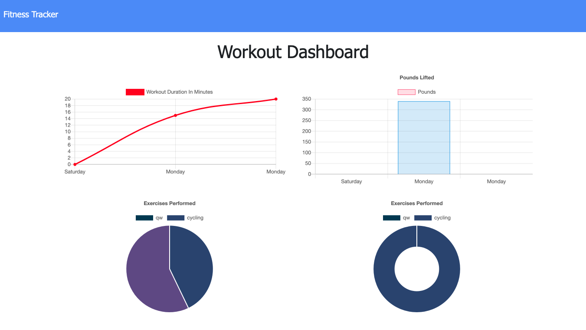

# Workout Tracker

A workout tracker applicatio that lets the user to reach their fitness goals more quicklu while they track their progress. 

## User Story

* As a user, I want to be able to view create and track daily workouts. I want to be able to log multiple exercises in a workout on a given day. I should also be able to track the name, type, weight, sets, reps, and duration of exercise. If the exercise is a cardio exercise, I should be able to track my distance traveled.

## Screenshots of the application

## Submission 

* The URL to the deployed application: https://betworkoutapp062021.herokuapp.com/

* The URL to the GitHub repository: https://github.com/betielbetu/Workout-Tracker
